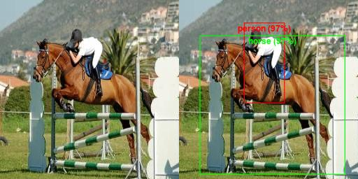
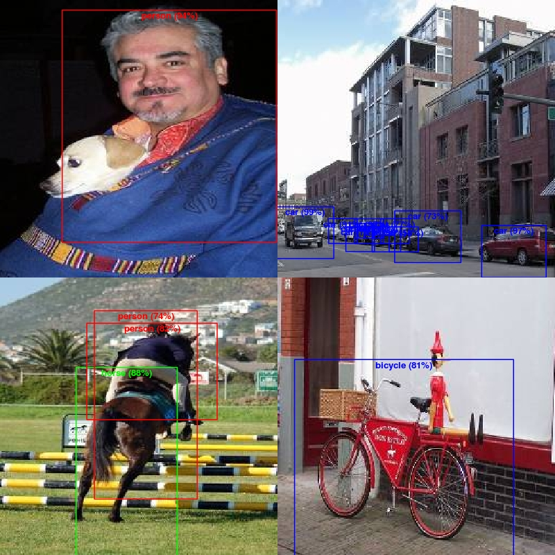

YOLO v3 in MxNetR
===

This is a simple example for implementing the YOLO by MxNetR. The idea is devoloped by Joseph Chet Redmon, and related details can be found in his [website](https://pjreddie.com/darknet/yolo/?utm_source=next.36kr.com). This is a simple example for MxNetR user, I will use a relatively small dataset for demonstrating how it work. 

# Future plan

**This repository is still being continuously updated**, and the future plan includes following items:

1. To adjust the appropriate hyperparameters for more accurate yolo model.

2. To add a COCO2017 training example and model.

# If you just want to use this model for predicting

You can use the code ["1. Prediction.R"](https://github.com/xup6fup/MxNetR-YOLO/blob/master/voc2007/code/3.%20Predicting/1.%20Prediction.R) for predicting an image. Here we prepared a well-trained model for your experiment. The 'yolo_v3 (1)-0000.params' and 'yolo_v3 (1)-symbol.json' can be found in the folder 'model/yolo model (voc2007)'. Here we use the 'test_img.jpeg' for testing the model. The left image is the raw image, and the right one is the prediction result by yolo v3 model.

  

Let try to predict other image!

# If you want to train a yolo v3 model

Download dataset and pre-processing
---

The Pascal VOC challenge is a very popular dataset for building and evaluating algorithms for image classification, object detection, and segmentation. I will use the mirror website for downloading **VOC2007** dataset. You can use the code ["1. download VOC2007.R"](https://github.com/xup6fup/MxNetR-YOLO/blob/master/voc2007/code/1.%20Processing%20data/1.%20download%20VOC2007.R) to quickly download this dataset (439 MB for training and 431 MB for testing). **Note: if you just want to use pre-trained model, you don't need to download this dataset.**

To simplify the problem, we will resize all images as 256×256. You can use the codes ["2-1. pre-processing image (train & val).R"](https://github.com/xup6fup/MxNetR-YOLO/blob/master/voc2007/code/1.%20Processing%20data/2-1.%20pre-processing%20image%20(train%20%26%20val).R) and ["2-2. pre-processing image (test).R"](https://github.com/xup6fup/MxNetR-YOLO/blob/master/voc2007/code/1.%20Processing%20data/2-2.%20pre-processing%20image%20(test).R) to do this work. Resized images will be converted as .RData and they totally used about 60 MB pre file for storing them. You can find them in the folder 'voc2007/data'

After we get the bounding box infomation in pevious stage, we can caculate the anchor boxes by k-mean clustering analysis. In yolo v3, there are 9 anchor boxes belonging feature map with 8 stride (3 smallest), 16 stride (3 meddle size), and 32 stride (3 biggest), respectively. You can use the codes ["3. Define the anchor boxes (for yolo v3).R"](https://github.com/xup6fup/MxNetR-YOLO/blob/master/voc2007/code/1.%20Processing%20data/3.%20Define%20the%20anchor%20boxes%20(for%20yolo%20v3).R) for conducting this process. Finally, we will get the **anchor_boxs (yolo v3).RData** for further application.

Training stage
---

The first step for using MxNet to train a yolo model is to build an iterator. You can use the codes ["1. Encode, Decode & Iterator.R"](https://github.com/xup6fup/MxNetR-YOLO/blob/master/voc2007/code/2.%20Training/1.%20Encode%2C%20Decode%20%26%20Iterator.R) for conducting this process. It is worth noting that bounding boxes are needed to encode as a special form for following training. Moreover, the encoded labels also need to pass a decoding process for restoring bounding boxes. The encode and decode function are the core of the yolo model. If you want to clearly understand the principle of yolo model, you can dismantle these functions to learn. The test codes for generating images are also included in that code, let's try it!

The next step is to define the model architecture. We use a pretrained model (training by imagenet for image recognition) and fine tune it. Here we contains a MxNet implementation of a MobileNets_V2-based YOLO networks. For details with Google's MobileNets, please read the following papers:

- [v1] [MobileNets: Efficient Convolutional Neural Networks for Mobile Vision Applications](https://arxiv.org/abs/1704.04861)
- [v2] [Inverted Residuals and Linear Bottlenecks: Mobile Networks for Classification, Detection and Segmentation](https://arxiv.org/abs/1801.04381)

The mobilenet-v2 model was contributed by [yuantangliang](https://github.com/yuantangliang)，and it can be downloaded from [this repository](https://github.com/yuantangliang/MobileNet-v2-Mxnet). The top-1/5 accuracy rates by using single center crop (crop size: 224x224, image size: 256xN):

Network|Top-1|Top-5|sha256sum|Architecture
:---:|:---:|:---:|:---:|:---:
MobileNet v2| 71.90| 90.49| a3124ce7 (13.5 MB)| [netscope](http://ethereon.github.io/netscope/#/gist/d01b5b8783b4582a42fe07bd46243986)

The model should be saved in folder 'model/pretrained model' for following use. If you want to train a more accurate model, you can to select other pretrained model from [MxNet model zoo](http://data.mxnet.io/models/imagenet/). I select a lightweight model is due to the limitation of Github that I cannot upload a file more than 100 MB. The code ["2. Model architecture.R"](https://github.com/xup6fup/MxNetR-YOLO/blob/master/voc2007/code/2.%20Training/2.%20Model%20architecture.R) includes yolo predict architecture and loss function, you can try to learn yolo v3 from these codes.

Now we can start to train this model! Because yolo v2 suggest that multi-scale training, so the training code is complex. The support functions can be found from ["3. Support functions.R"](https://github.com/xup6fup/MxNetR-YOLO/blob/master/voc2007/code/2.%20Training/3.%20Support%20functions.R), and finally you can use ["4. Train a yolo model.R"](https://github.com/xup6fup/MxNetR-YOLO/blob/master/voc2007/code/2.%20Training/4.%20Train%20a%20yolo%20model.R) for training this model. It is worth noting that the total training time in this sample is about 35 hours in single P100 GPU server.

Model performance
---

Finally, we get a model, snd the MAP50 in testing set is 20.29%. The reason of this MAP is considered as the serious overfitting, so you can add training samples. Following image is the selected predicting results by our model:

  

You can use the code ["5. Test the model performance.R"](https://github.com/xup6fup/MxNetR-YOLO/blob/master/voc2007/code/2.%20Training/5.%20Test%20the%20model%20performance.R) for conducting this process. Because this is a simple example for yolo v3, our database only includes 4,008 training images and 1,003 validation images, so I consider this result is very good.

# If your understanding of YOLO is not clear, you can start with a simple example for YOLO v1

Download dataset and pre-processing
---

The pikachu dataset is a simple object detection task building by MxNet support team. It use a synthetic toy dataset by rendering images from open-sourced 3D Pikachu models. 

For more detail. Please see：
-  https://gluon.mxnet.io/chapter08_computer-vision/object-detection.html.
-  http://zh.gluon.ai/chapter_computer-vision/pikachu.html.

I will use [this website](https://apache-mxnet.s3-accelerate.amazonaws.com/gluon/dataset/pikachu/) for downloading this dataset. You can use the code ["1. Build jpg data from source.R"](https://github.com/xup6fup/MxNetR-YOLO/blob/master/pikachu/code/1.%20Processing%20data/1.%20Build%20jpg%20data%20from%20source.R) to quickly download this dataset (84 MB for training and 10 MB for testing), and further procees them to jpeg file. **Note: this repository has included all data of pikachu dataset, so you can skip this step.**

For follow-up training tasks, we need to process these data to .RData file. You can use the codes ["2-1. Processing image (train).R"](https://github.com/xup6fup/MxNetR-YOLO/blob/master/voc2007/code/1.%20Processing%20data/2-1.%20pre-processing%20image%20(train%20%26%20val).R) and ["2-2. Processing image (val).R"](https://github.com/xup6fup/MxNetR-YOLO/blob/master/voc2007/code/1.%20Processing%20data/2-2.%20pre-processing%20image%20(test).R) to do this work. You can find them in the folder 'pikachu/data' **Note: you can also skip this step.**

Training stage
---

